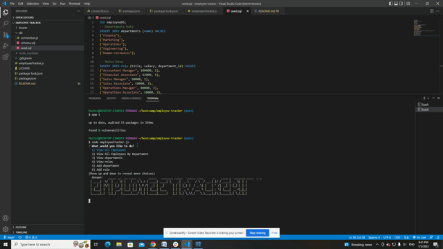

# My Employee Tracker


## User Story
```
AS A business owner
I WANT to be able to view and manage the departments, roles, and employees in my company
SO THAT I can organize and plan my business
```

## Acceptance Criteria
```
GIVEN a command-line application that accepts user input
WHEN I start the application
THEN I am presented with the following options: view all departments, view all roles, view all employees, add a department, add a role, add an employee, and update an employee role
WHEN I choose to view all departments
THEN I am presented with a formatted table showing department names and department ids
WHEN I choose to view all roles
THEN I am presented with the job title, role id, the department that role belongs to, and the salary for that role
WHEN I choose to view all employees
THEN I am presented with a formatted table showing employee data, including employee ids, first names, last names, job titles, departments, salaries, and managers that the employees report to
WHEN I choose to add a department
THEN I am prompted to enter the name of the department and that department is added to the database
WHEN I choose to add a role
THEN I am prompted to enter the name, salary, and department for the role and that role is added to the database
WHEN I choose to add an employee
THEN I am prompted to enter the employee’s first name, last name, role, and manager, and that employee is added to the database
WHEN I choose to update an employee role
THEN I am prompted to select an employee to update and their new role and this information is updated in the database 
```

## Description
This app is a Content Management Systems that make it easy for non-developers to view and interact with information stored in databases using node, inquirer, MySQL, and console.table. 

## Table of contents
* [Description](#Description)
* [Installation](#Installation)
* [Usage](#Usage)
* [License](#License)
* [Contributing](#Contributing)
* [Screenshot](#Screenshot)
* [Questions](#Questions)
## Installation
The app uses node, inquirer, console.table and MySQL. So the user need to intall the all dependancies by running ```npm i```.
## Usage
After installing all the dependencies, run ```node employeeTracker.js``` in your termial command. Then use the keyboard arrows to select and respond to all the prompt questions. 
The user can view, add, update and remove employees information.
## Licence
This app is under the MIT License.
## Contributing
If anyone want to improve the app, feel free to contact me.
## Screenshot
[Click here to see the demo video](https://youtu.be/eneBGbjI7x4)


## Questions
Contact me: muchir99@gmail.com

My Github: https://github.com/muchirbickel